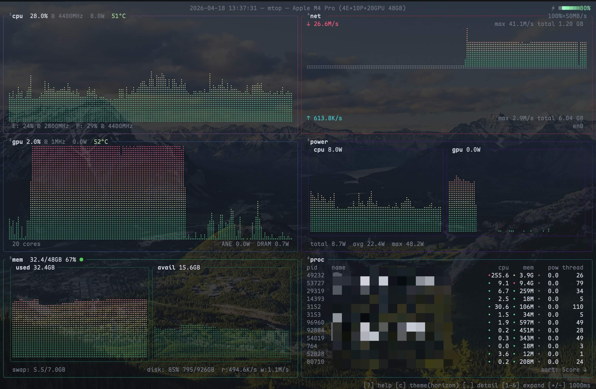
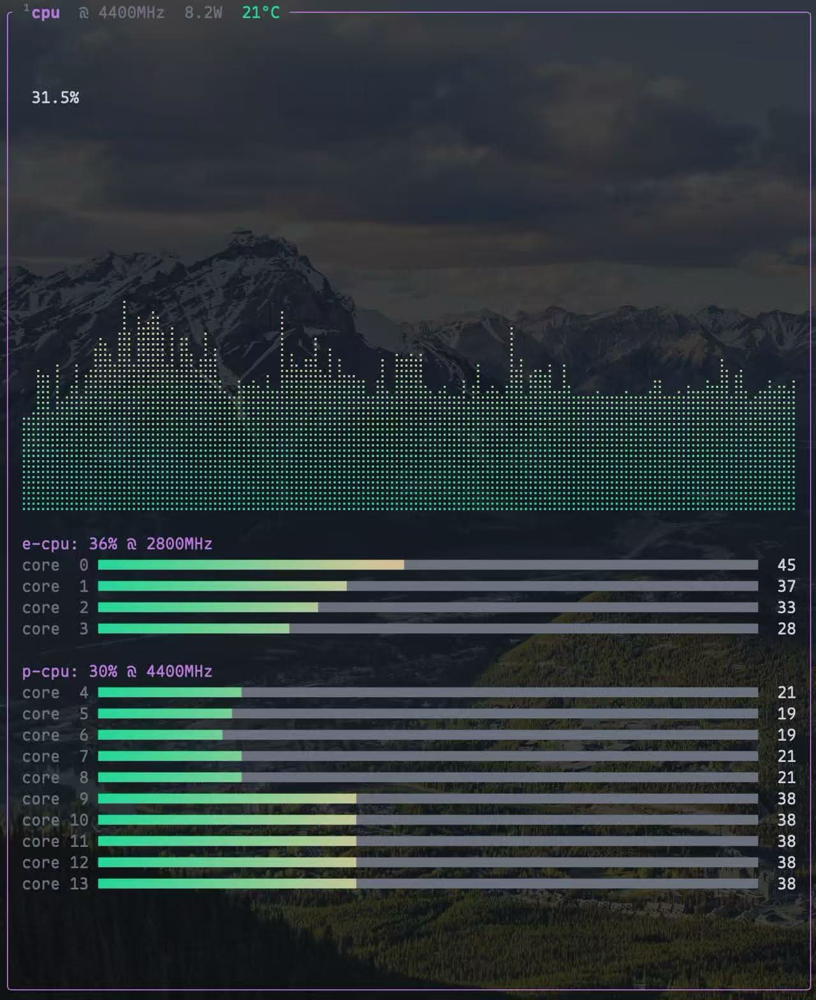
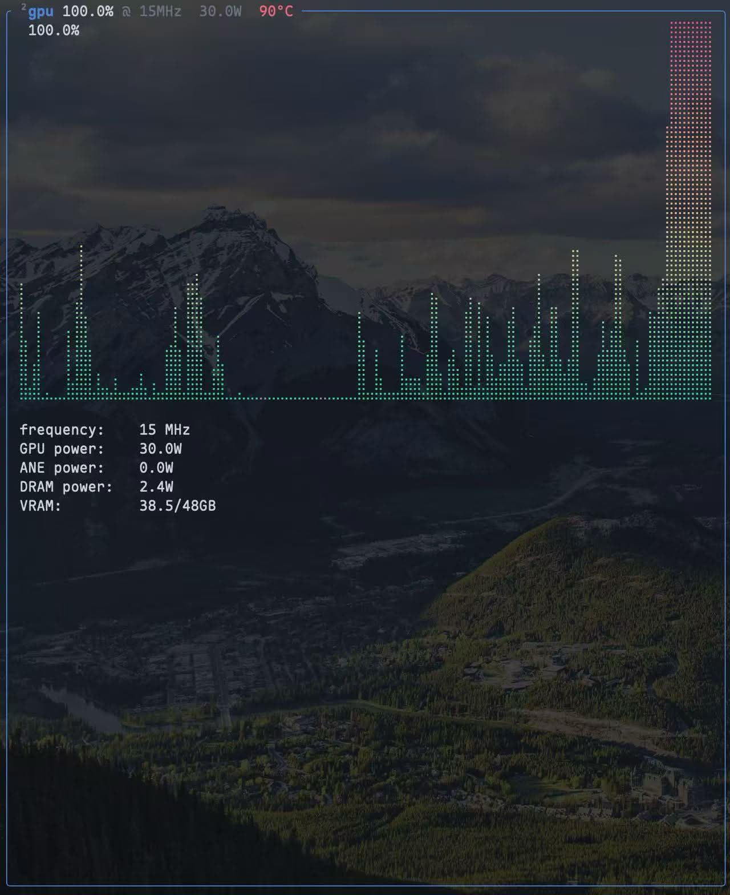
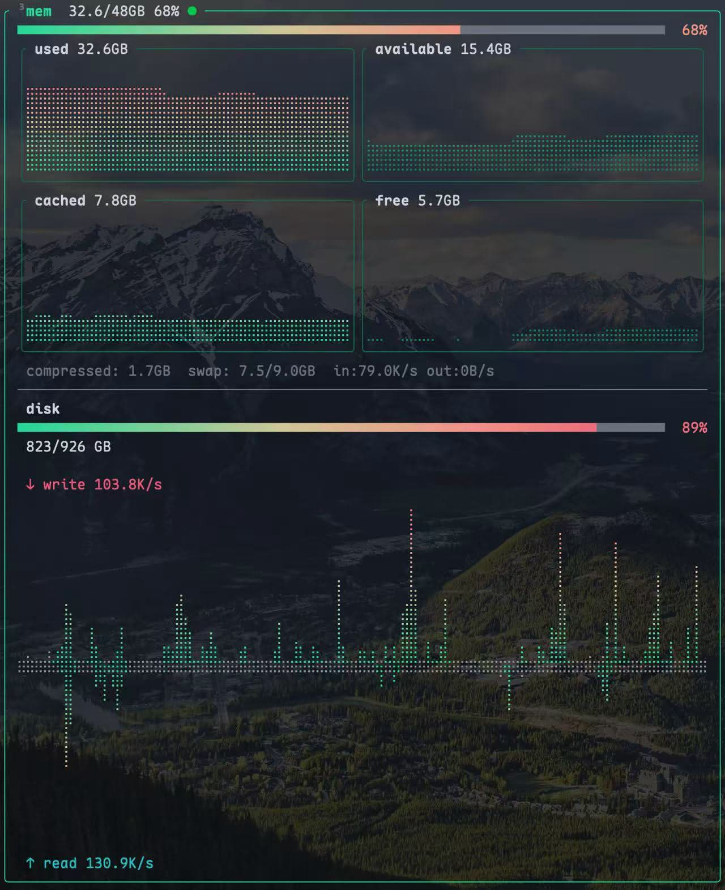
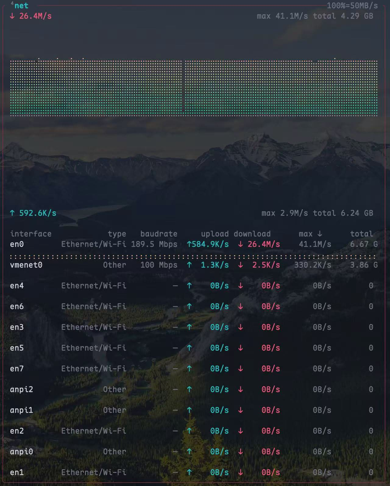
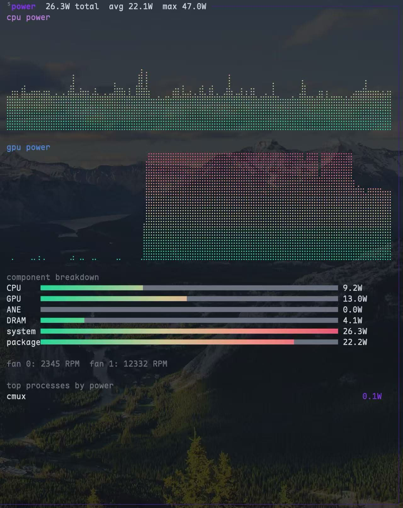
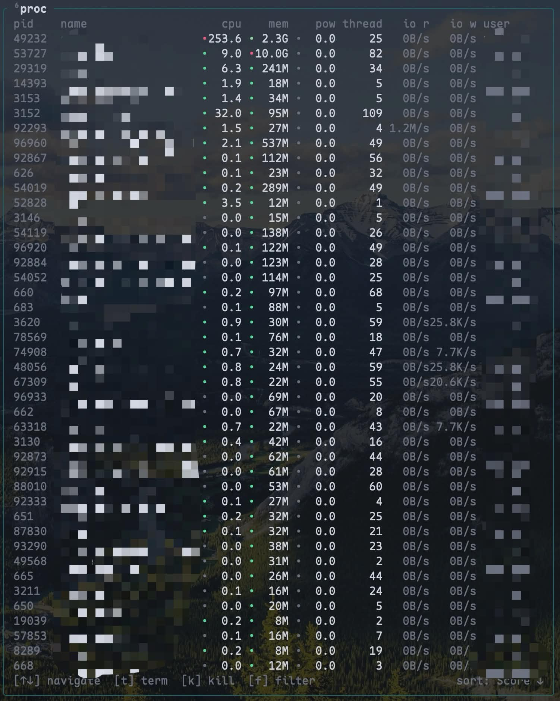

# mtop

[](https://github.com/Zeugsein/mtop/actions/workflows/ci.yml)
[](LICENSE)
[](https://crates.io/crates/mtop-tui)
[](https://github.com/Zeugsein/mtop)
[](https://www.rust-lang.org)

A sudo-less system monitor for Apple Silicon Macs. Beautiful real-time braille graphs for CPU, GPU, temperature, memory, disk, network, power, and processes.

Built for heavy workloads such as running agents with local models.



## Motivation

When doing agentic engineering and running local models on an M-series Mac, once the device turns into a space heater, I need to know exactly what's happening:

- How loaded are the CPU and GPU, and what's the trend? How are their temperatures? (I have semiconductor + water cooling + fans for them, but still)
- Memory pressure and disk I/O, because I use [omlx](https://github.com/jundot/omlx) with quantized models with KV cache offload to SSD
- The transfer rate level when downloading a model
- Power draw breakdown as an additional metric to cross-check
- The processes using most CPU, memory, and power (sorted by an overall score, so I don't need to sort by each)

No existing tool had all of this in one terminal window with beautiful graphs. So I built `mtop`, where `m` stands for Mac, M-series, and monitoring, and `top` rings a bell.

Before building mtop, I used a combination of tools; see [Acknowledgements](#acknowledgements).

---

## Requirements

- **macOS** Sequoia 15.x (tested on 15.5; earlier versions untested)
- **Apple Silicon**: tested on M4 Pro
- **Rust** (stable): [install via rustup.rs](https://rustup.rs)
- **Terminal** with true-color and GPU-accelerated rendering: tested on [Ghostty](https://github.com/ghostty-org/ghostty)

## Install

```sh
cargo install mtop-tui --locked
```

Installs `mtop` to `~/.cargo/bin/`. Make sure that directory is in your `PATH`.

### Install development version

```sh
cargo install --git https://github.com/Zeugsein/mtop --locked
```

## Quick start

```sh
mtop                                         # launch dashboard
mtop --interval 500 --color dracula          # 500 ms refresh, dracula theme
mtop --temp-unit fahrenheit                  # temperatures in °F
```


## Panels

The dashboard arranges 6 panels in a two-column grid:

| Left column   | Right column |
|---------------|--------------|
| CPU cores     | Network      |
| GPU           | Power        |
| Memory / Disk | Process list |

Press `1`–`6` to expand or collapse a panel.

<details>
<summary>CPU panel: per-core utilization, E/P cluster breakdown</summary>



Expanded view shows per-core bars for efficiency and performance clusters, with cluster frequency and aggregate utilization in the title bar.

</details>

<details>
<summary>GPU panel: utilization, VRAM, power, temperature</summary>



Expanded view shows GPU frequency (MHz), GPU power (W), ANE power (W), DRAM power (W), and VRAM usage (used / total GB).

</details>

<details>
<summary>Memory / Disk panel: memory pressure and disk I/O</summary>



Expanded memory view shows a 2×2 grid of sparkline charts: used, available, cached, free. Disk shows a symmetric read/write I/O chart with live rates.

</details>

<details>
<summary>Network panel: per-interface traffic, cumulative totals</summary>



Expanded view shows a symmetric upload/download chart (download grows upward, upload downward) with a ranked interface table showing baud rate, upload, download, session max, and cumulative total.

</details>

<details>
<summary>Power panel: per-component breakdown, fan speed</summary>



Expanded view shows CPU and GPU power sparklines, a component breakdown bar chart (CPU, GPU, ANE, DRAM, system, package), fan RPM, and top processes by power draw.

</details>

<details>
<summary>Process panel: sortable by CPU, memory, or power</summary>



Sortable by Score (weighted), CPU%, Memory, Power, PID, or Name. Press `t` to send SIGTERM, `f` to filter by name.

</details>

---

## Modes

### TUI dashboard (default)

```sh
mtop
mtop --interval 500 --color dracula --temp-unit fahrenheit
```

### Pipe mode (NDJSON)

```sh
mtop pipe              # infinite stream, one JSON object per sample
mtop pipe --samples 10 # emit 10 samples then exit
```

Pipe output to `jq`, log files, or any JSON consumer.

### HTTP API server

```sh
mtop serve --port 9090 --bind 127.0.0.1
```

| Endpoint | Description |
|----------|-------------|
| `GET /json` | Full metrics snapshot as JSON |
| `GET /metrics` | Prometheus text exposition format |

### Debug

```sh
mtop debug
```

Prints SoC detection info and diagnostic details. Useful for confirming IOReport and SMC availability.


## Key bindings

| Key | Action |
|-----|--------|
| `q` | Quit |
| `Esc` | Collapse expanded panel, or quit |
| `1`–`6` | Expand / collapse panel (CPU, GPU, Mem, Net, Power, Process) |
| `e` / `Enter` | Collapse expanded panel |
| `s` | Cycle process sort mode |
| `w` | Save current theme, interval, and sort to config |
| `c` | Cycle color theme forward |
| `C` | Cycle color theme backward |
| `j` / `↓` | Scroll process list down |
| `k` / `↑` | Scroll process list up |
| `t` | Send SIGTERM to selected process |
| `f` | Filter process list by name |
| `y` / `n` | Confirm / cancel pending signal |
| `+` / `-` | Increase / decrease sample interval |
| `.` | Toggle detail mode |
| `h` / `?` | Toggle help overlay |

Process sort modes: Score, CPU%, Memory, Power, PID, Name.


## Themes

10+ built-in themes. Cycle with `c` / `C` while running, or set a default:

```toml
# ~/.config/mtop/config.toml
theme = "horizon"
```


## Configuration

mtop reads `~/.config/mtop/config.toml` on startup. CLI flags override config values.

```toml
interval_ms = 1000
theme = "horizon"
temp_unit = "celsius"   # or "fahrenheit"
```


## Architecture

See [ARCHITECTURE.md](ARCHITECTURE.md).


## Acknowledgements

Before developing mtop, I was using a Zellij session with btop on the left, and macmon and mactop (mactop v1 required sudo) stacked on the right.

| Project | Language | TUI | Loved bits and inspirations |
|---------|----------|-----|-----------------------------|
| [btop](https://github.com/aristocratos/btop) | C++ | custom renderer | Beautiful braille graphs, themes and panel layout |
| [macmon](https://github.com/vladkens/macmon) | Rust | ratatui | Fixed 100% scale, temperature, and power metrics |
| [mactop](https://github.com/context-labs/mactop) | Go | termui | Horizontal usage gauge and cross-check on certain metrics |
| [macpow](https://github.com/k06a/macpow) | Rust | ratatui | Idea of a power tree |


## Contributing

mtop is maintained by [an agentic engineering workflow](AGENTS.md): the maintainer and their agents working together through each iteration. Humans and agents alike are welcome to contribute ideas, intent, design proposals, or code links as GitHub issues. Pull requests are not accepted; contributions enter the cycle as [idea files](https://x.com/karpathy/status/2040470801506541998).

## License

MIT
